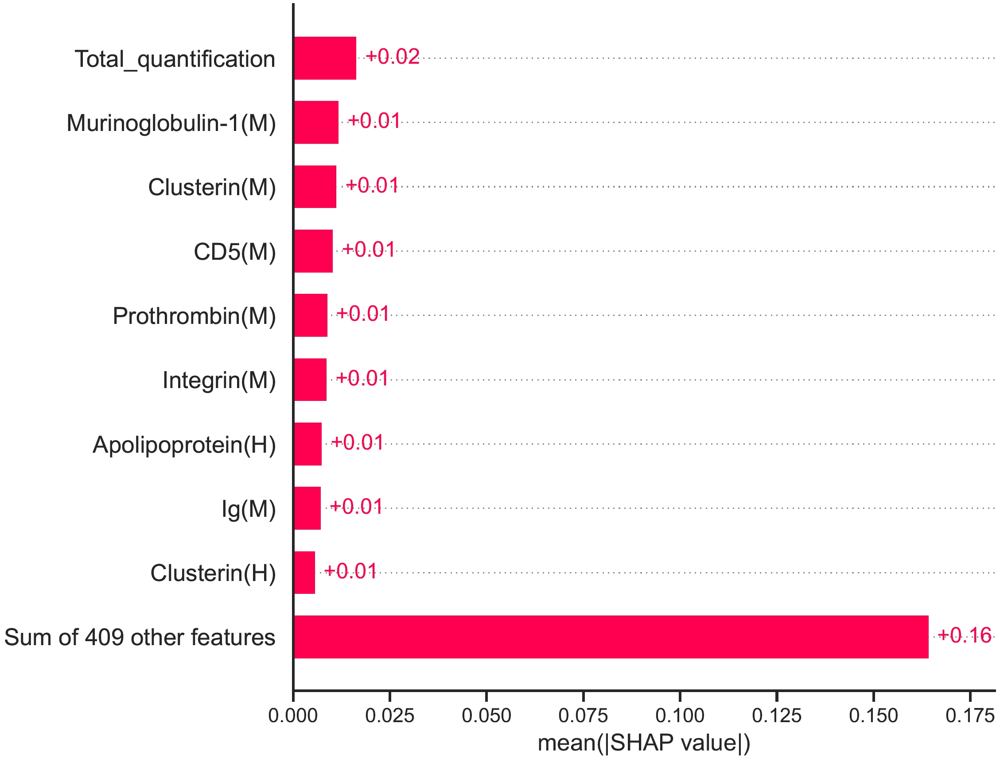
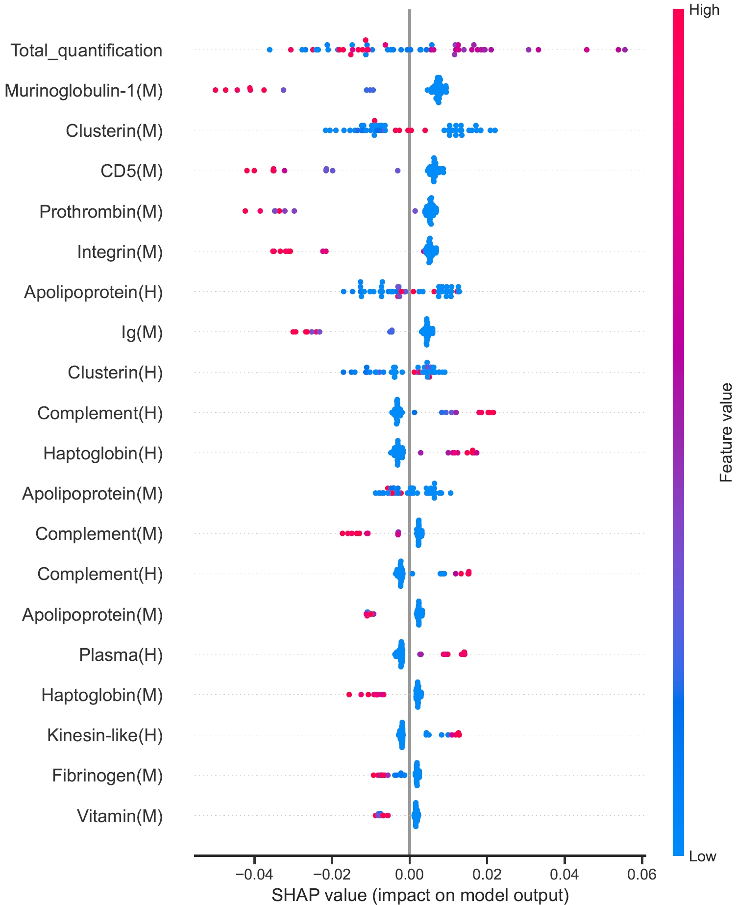
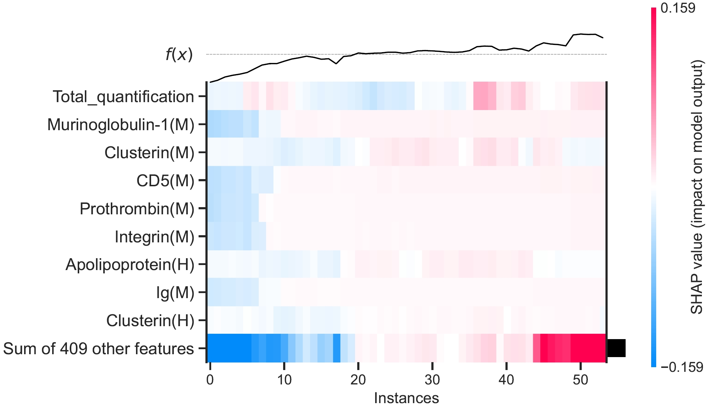
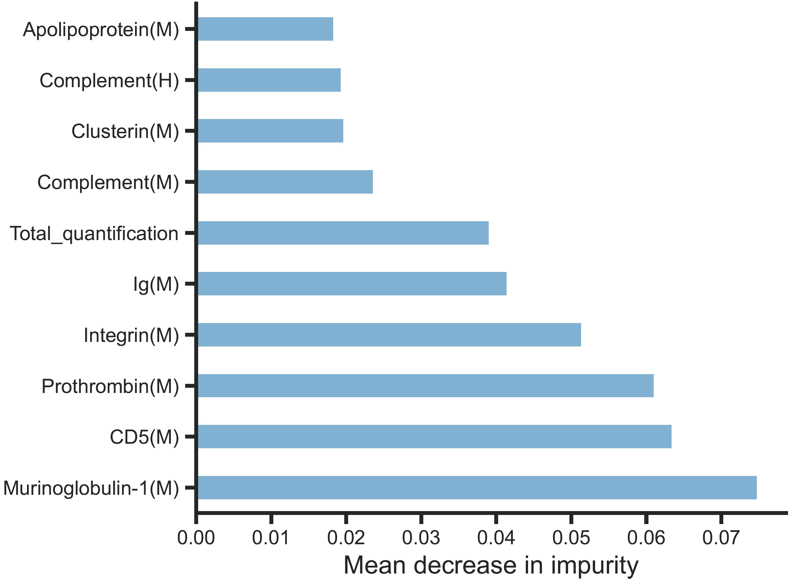
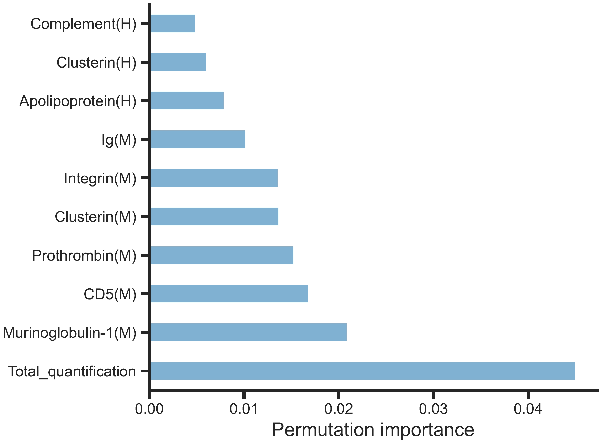

It is important to evaluate the contributions of features to stealth effect prediction for different pre-coating nanoparticles under plasma challenges.

# Usage
We use three methods, including `Mean decrease in impurity (MDI)`, `Permutation importance`, and `Shap`, to evaluate contributions of features. We select top 10 features for visualisation. Important features resulting from our prior knowledge overlap with those from the following computationally inferred feature contribution.


=== "MDI"

    ``` py
    import pcser as pcs

    df = pcs.load.feature_contribution(
        data_ref_fpn='D:/Document/Programming/Python/pcser/pcser/data/hu_macrophage/Proteomics_07262023_rv_C57BL6_spl54.xlsx',
        fi_met='mdi',  # None shap mdi pi
        sv_fp='D:/Document/Programming/Python/pcser/pcser/data/',  # None to('data/')
        is_norm=True,
        norm_met='minmax',  # minmax std maxabs
        mode='compo',  # compo annot
        mark='spl54',  # spl54 spl63
        seed=4,
        version='extended',  # extended old
    )
    df
    
    ```

=== "PI"

    ``` py
    import pcser as pcs

    df = pcs.load.feature_contribution(
        data_ref_fpn='D:/Document/Programming/Python/pcser/pcser/data/hu_macrophage/Proteomics_07262023_rv_C57BL6_spl54.xlsx',
        fi_met='pi',  # None shap mdi pi
        sv_fp='D:/Document/Programming/Python/pcser/pcser/data/',  # None to('data/')
        is_norm=True,
        norm_met='minmax',  # minmax std maxabs
        mode='compo',  # compo annot
        mark='spl54',  # spl54 spl63
        seed=4,
        version='extended',  # extended old
    )
    df
            
    ``` 

=== "Shap"

    ``` py
    import pcser as pcs

    df = pcs.load.feature_contribution(
        data_ref_fpn='D:/Document/Programming/Python/pcser/pcser/data/hu_macrophage/Proteomics_07262023_rv_C57BL6_spl54.xlsx',
        fi_met='shap',  # None shap mdi pi
        sv_fp='D:/Document/Programming/Python/pcser/pcser/data/',  # None to('data/')
        is_norm=True,
        norm_met='minmax',  # minmax std maxabs
        mode='compo',  # compo annot
        mark='spl54',  # spl54 spl63
        seed=4,
        version='extended',  # extended old
    )
    df
            
    ``` 


# Attributes
!!! Illustration

    === "Regular"
        
        ``` c++ 
        data_ref_fpn: full path to data used for training and as a reference for further use
        sv_fp: full path to save data. Please note that it will save the training data and resulting data if it is not set as None.
        is_norm: if data is normalised. Default: True
        norm_met: normalisation method. It can be minmax, std, or maxabs.
        mode: composition or annotation. It can be compo or annot. Default: compo 
        mark: mark for denoting and being part of file name.
        seed: seed to shufle data and train models. Default: 4
        version: It can be extended or old. extended will include added PBS data. Default: 'extended'
        
        ```

    === "Added"

        ``` c++
        fi_met: method that is used to infer feature importance

        ```


# Visualisation

=== "Shap"
    <figure markdown="span">
      { align=left width="600"}
      <figcaption>Top-ranked features using Shap values</figcaption>
    </figure>
    <figure markdown="span">
      { align=left width="600"}
      <figcaption>Summary of Shap values</figcaption>
    </figure>
    <figure markdown="span">
      { align=left width="600"}
      <figcaption>Heatmap of Shap values</figcaption>
    </figure>

=== "MDI"
    <figure markdown="span">
      { align=left width="600"}
      <figcaption>Mean decrease in impurity (MDI)</figcaption>
    </figure>


=== "PI"
    <figure markdown="span">
      { align=left width="600"}
      <figcaption>Permutation importance</figcaption>
    </figure>


# Output

`df` contains PCSER predictions of the stealth effects and MFI values.

=== "MDI"

    ``` py
    You are using extended sheets.
    You have selected the minmax normalization method.
    Downcasting object dtype arrays on .fillna, .ffill, .bfill is deprecated and will change in a future version. Call result.infer_objects(copy=False) instead. To opt-in to the future behavior, set `pd.set_option('future.no_silent_downcasting', True)`
    Downcasting object dtype arrays on .fillna, .ffill, .bfill is deprecated and will change in a future version. Call result.infer_objects(copy=False) instead. To opt-in to the future behavior, set `pd.set_option('future.no_silent_downcasting', True)`
    Data summary:
    Number of samples: 54
    Number of features: 419


                            importance
    Murinoglobulin-1(M)170	0.074869
    CD5(M)151	0.063512
    Prothrombin(M)156	0.061111
    Integrin(M)223	0.051449
    Ig(M)172	0.041529
    ...	...
    Dihydropyrimidinase-related(M)344	0.000000
    Ribosome-binding(M)343	0.000000
    Cell(M)342	0.000000
    RING(M)341	0.000000
    H-2(M)417	0.000000
    418 rows × 1 columns
    ```

=== "PI"

    ``` py
    You are using extended sheets.
    You have selected the minmax normalization method.
    Downcasting object dtype arrays on .fillna, .ffill, .bfill is deprecated and will change in a future version. Call result.infer_objects(copy=False) instead. To opt-in to the future behavior, set `pd.set_option('future.no_silent_downcasting', True)`
    Downcasting object dtype arrays on .fillna, .ffill, .bfill is deprecated and will change in a future version. Call result.infer_objects(copy=False) instead. To opt-in to the future behavior, set `pd.set_option('future.no_silent_downcasting', True)`
    Data summary:
    Number of samples: 54
    Number of features: 419

                        importance
    Total_quantification	0.045018
    Murinoglobulin-1(M)170	0.020921
    CD5(M)151	0.016849
    Prothrombin(M)156	0.015282
    Clusterin(M)3	0.013689
    ...	...
    UPF0575(M)320	-0.000056
    Alpha-2-macroglobulin(H)11	-0.000059
    U2(M)226	-0.000066
    Mannose-binding(M)313	-0.000075
    Ryanodine(M)242	-0.000099
    418 rows × 1 columns
    ```

=== "Shap"

    ``` py
    You are using extended sheets.
    You have selected the minmax normalization method.
    Downcasting object dtype arrays on .fillna, .ffill, .bfill is deprecated and will change in a future version. Call result.infer_objects(copy=False) instead. To opt-in to the future behavior, set `pd.set_option('future.no_silent_downcasting', True)`
    Downcasting object dtype arrays on .fillna, .ffill, .bfill is deprecated and will change in a future version. Call result.infer_objects(copy=False) instead. To opt-in to the future behavior, set `pd.set_option('future.no_silent_downcasting', True)`
    Data summary:
    Number of samples: 54
    Number of features: 419
    
    'Finished'
    ```