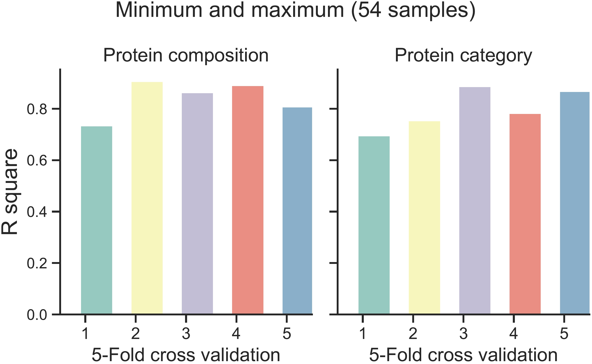
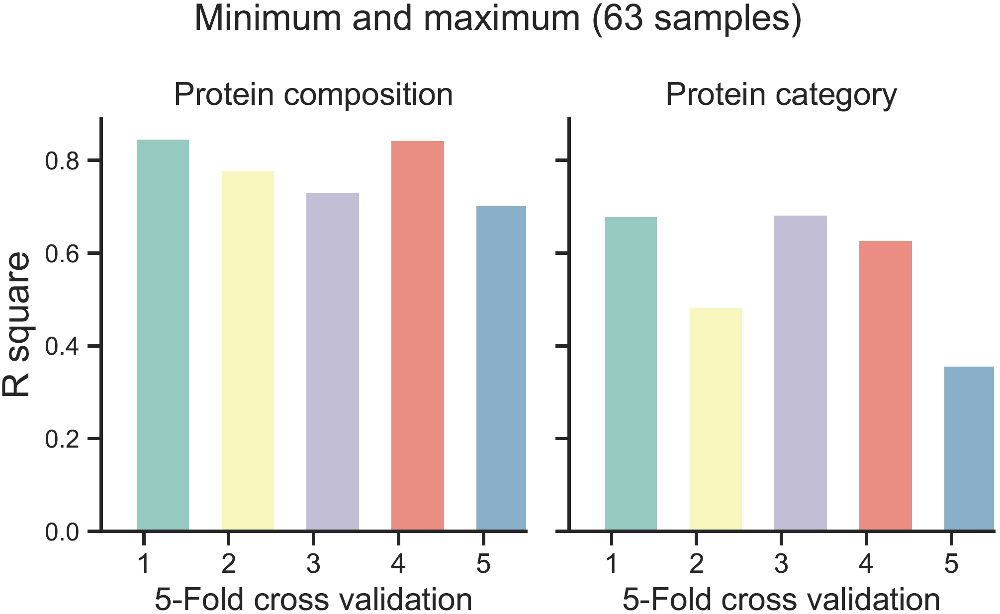
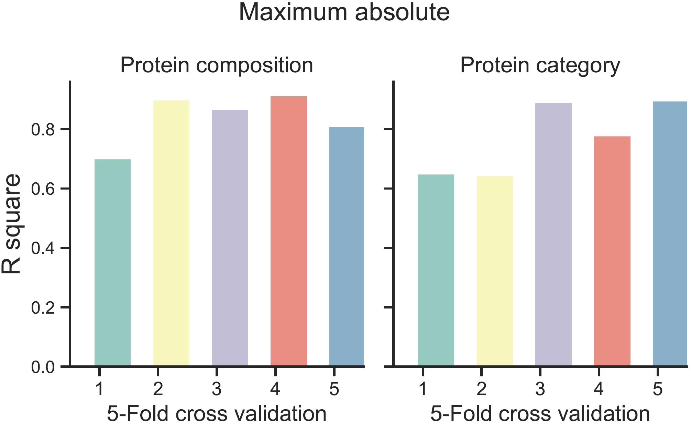
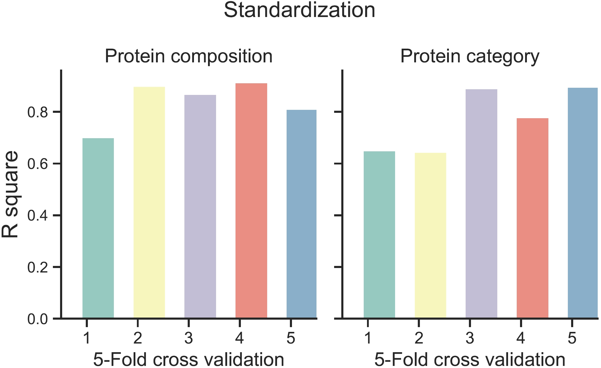

It is important to evaluate the contributions of features to stealth effect prediction for different pre-coating nanoparticles under plasma challenges.

# Usage
We move to display R square values (R2) and Mean squared error (MSE) between predicted and real values using the output from the model building processes.

Because we manually shortlisted samples for training for preventing noise samples, there are two groups of samples, one with 54 samples (`spl54`) and the other one with 63 samples (`spl63`). We output their results as well as other results to benchmark if normalisation method choices could affect the prediction outcome.


=== "minmax (spl54)"

    ``` py
    import pcser as pcs

    pcs.load.plot_res(
        compo_fpn='D:/Document/Programming/Python/pcser/pcser/data/r2_kfold_compo_extended_minmax_spl54.txt',
        annot_fpn='D:/Document/Programming/Python/pcser/pcser/data/r2_kfold_annot_extended_minmax_spl54.txt',
        criterion='r2',
        met='minmax',
    )
    
    ```

=== "minmax (spl63)"

    ``` py
    import pcser as pcs

    pcs.load.plot_res(
        compo_fpn='D:/Document/Programming/Python/pcser/pcser/data/r2_kfold_compo_extended_minmax_spl63.txt',
        annot_fpn='D:/Document/Programming/Python/pcser/pcser/data/r2_kfold_annot_extended_minmax_spl63.txt',
        criterion='r2',
        met='minmax',
    )
            
    ``` 

=== "standardisation"

    ``` py
    import pcser as pcs

    pcs.load.plot_res(
        compo_fpn='D:/Document/Programming/Python/pcser/pcser/data/r2_kfold_compo_extended_std_spl54.txt',
        annot_fpn='D:/Document/Programming/Python/pcser/pcser/data/r2_kfold_annot_extended_std_spl54.txt',
        criterion='r2',
        met='minmax',
    )
            
    ``` 

=== "maxabs"

    ``` py
    import pcser as pcs

    pcs.load.plot_res(
        compo_fpn='D:/Document/Programming/Python/pcser/pcser/data/r2_kfold_compo_extended_maxabs_spl54.txt',
        annot_fpn='D:/Document/Programming/Python/pcser/pcser/data/r2_kfold_annot_extended_maxabs_spl54.txt',
        criterion='r2',
        met='minmax',
    )
            
    ``` 

# Attributes
!!! Illustration
 
    ``` c++ 
    compo_fpn: full path to the R square results predicted according to proteomics compositional data
    annot_fpn: full path to the R square results predicted according to proteomics categorical data
    criterion: R square or MSE. r2 or mse
    met: normalisation method. It can be minmax, std, or maxabs.
    
    ```


# Visualisation

=== "minmax (spl54)"
    <figure markdown="span">
      { align=left width="600"}
      <figcaption>Top-ranked features using Shap values</figcaption>
    </figure>
    

=== "minmax (spl63)"
    <figure markdown="span">
      { align=left width="600"}
      <figcaption>Mean decrease in impurity (MDI)</figcaption>
    </figure>


=== "standardisation"
    <figure markdown="span">
      { align=left width="600"}
      <figcaption>Permutation importance</figcaption>
    </figure>


=== "maxabs"
    <figure markdown="span">
      { align=left width="600"}
      <figcaption>Permutation importance</figcaption>
    </figure>
